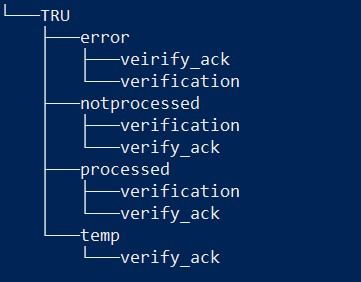

### Project TRU using Powershell

This implementation is implemented in Powershell and uses the Sharepoint client object model to manipulate the Sharepoint list. The project has the client and server side. The client is used by user to upload data into the Sharepoint while the server is run as a job to retrieve the list data and generate a file which will upload into a ftp server.

The directory structure for the server is

